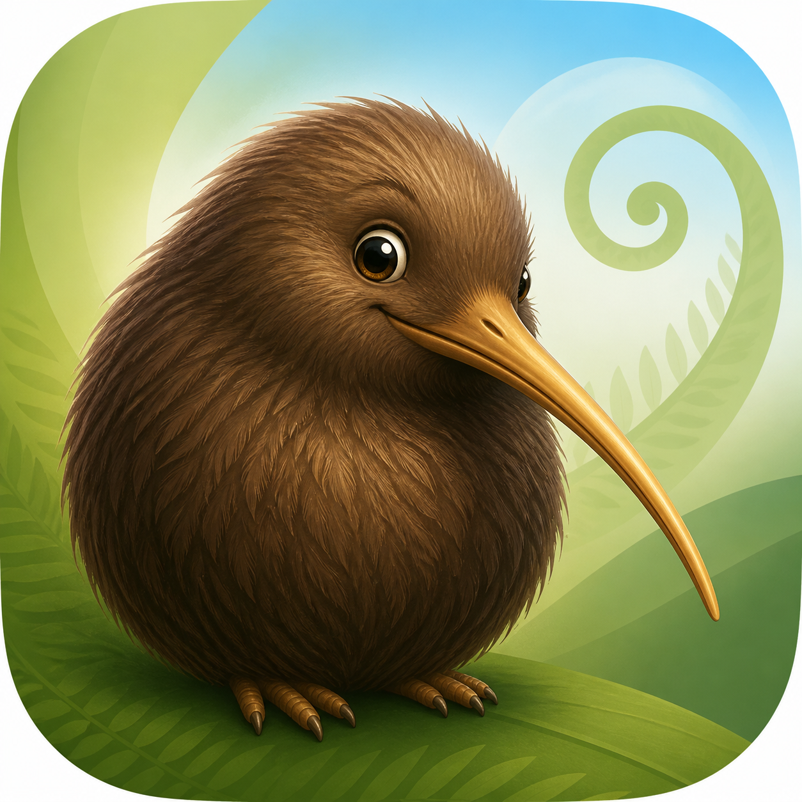
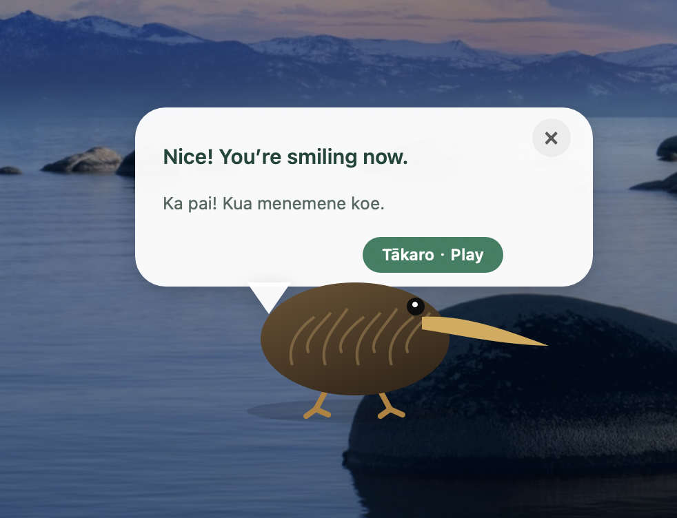
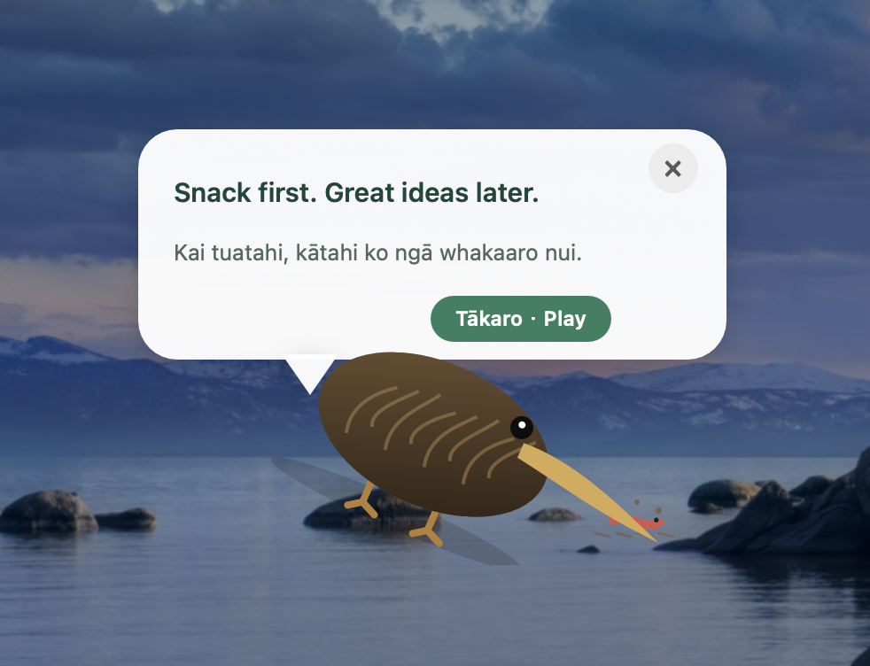
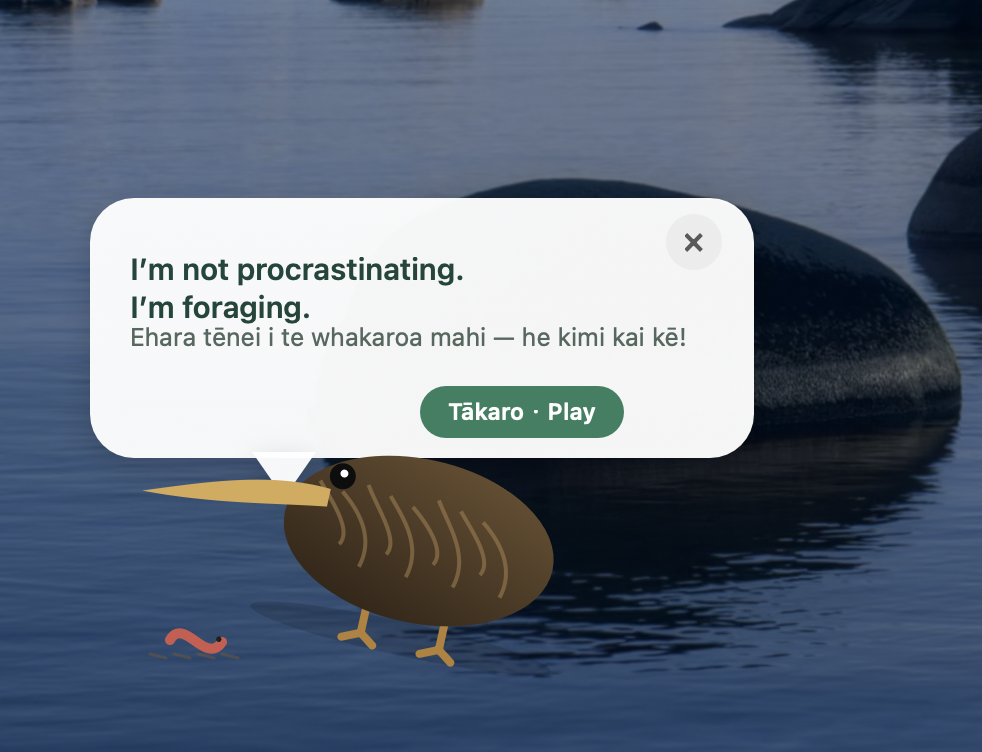
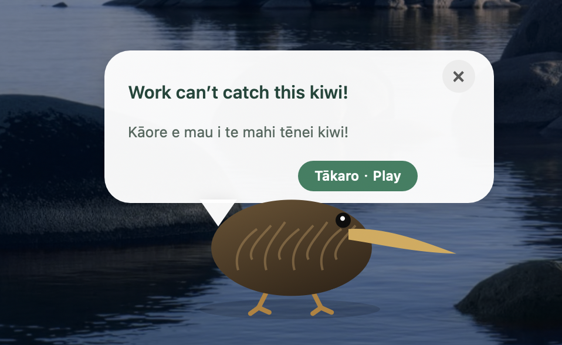

# Kukuda

<p align="center">
  
</p>

<p align="center">
  <strong>A playful little kiwi who appears when it is time to rest.</strong><br>
  <strong>He kiwi iti ngahau ka puta mai ina tae ki te wā whakatā.</strong><br>
  <strong>一只会在该休息时出来巡场、觅食和逗你玩的 Kiwi。</strong>
</p>

<p align="center">
  <a href="#english">English</a> ·
  <a href="#te-reo-māori">Te reo Māori</a> ·
  <a href="#中文">中文</a>
</p>

## Kukuda on your desktop · Kukuda i runga i tō papamahi · 桌面实景

<table>
  <tr>
    <td width="50%">
      
    </td>
    <td width="50%">
      
    </td>
  </tr>
  <tr>
    <td align="center">Keep smiling · Kia menemene tonu · 多笑笑</td>
    <td align="center">Snack first · Kai tuatahi · 吃饭第一</td>
  </tr>
  <tr>
    <td width="50%">
      
    </td>
    <td width="50%">
      
    </td>
  </tr>
  <tr>
    <td align="center">Foraging time · He wā kimi kai · 认真刨地觅食</td>
    <td align="center">Work can’t catch this kiwi · Kāore e mau i te mahi tēnei kiwi · 工作抓不到这只 Kiwi</td>
  </tr>
</table>

---

## English

Kukuda is a lightweight, native macOS break reminder. After a period of active
computer use, Kukuda wanders onto the screen, shares playful reminders in te reo
Māori and English, and invites you to take a real break.

### Features

- Menu-bar countdown with 1, 15, 30, 45, and 60 minute intervals.
- Pause, reset, summon Kukuda immediately, or launch automatically at login.
- Random wandering across the whole screen while staying inside the visible display area.
- Jumping, dancing, ground-probing, foraging, preening, napping, calling, and worm-eating animations.
- 52 playful te reo Māori and English messages matched to Kukuda's actions.
- Short inactivity pauses the timer; five minutes away resets the work session.
- No analytics, no account, no network requests, and no third-party runtime dependencies.

### Download

Download the newest `Kukuda-…-macOS-universal.zip` from
[GitHub Releases](https://github.com/xyh169/Kukuda-Desktop-Pet-Break-Reminder/releases),
unzip it, and move `Kukuda.app` to your Applications folder.

Kukuda is currently ad-hoc signed rather than Apple-notarized. On first launch,
macOS may ask you to right-click the app and choose **Open**. The source is
available here for inspection and local builds.

### How it works

The menu-bar title shows the remaining time, such as `Kukuda · 29:42`.

- **Show Kukuda Now · Karangatia a Kukuda** summons Kukuda immediately.
- **Pause Timer · Whakatārewatia** stops counting without quitting the app.
- **Reset Work Session · Tīmata anō** starts the current cycle again.
- **Reminder Interval · Wā whakamaumahara** changes the work interval.
- **Start at Login · Tīmata aunoa** launches Kukuda automatically after sign-in.
- Click Kukuda or **Tākaro · Play** to trigger a playful dance.
- Click the bubble's `×` to dismiss Kukuda and begin a new work cycle.

### Privacy

Kukuda runs entirely on your Mac. It only reads the number of seconds since the
last keyboard or mouse event to distinguish active use from a break. It does not
read keystrokes, capture the screen, access documents, connect to a server, or
collect analytics.

### Build from source

Requirements: macOS 13 or later and Apple Command Line Tools.

```sh
./测试.command
KIWI_BREAK_NO_OPEN=1 ./构建并运行.command
```

The built app is written to `build/Kukuda.app`. Create a release archive with:

```sh
./scripts/package-release.sh
```

---

## Te reo Māori

He taupānga macOS taketake, māmā hoki a Kukuda hei whakamahara i a koe ki te
whakatā. Kia roa koe e whakamahi kaha ana i tō rorohiko, ka hīkoi matapōkere mai
a Kukuda i runga i te mata, ka tuku kōrero ngahau i te reo Māori me te reo
Pākehā, ā, ka tono kia whakatā tūturu koe.

### Ngā āhuatanga

- He tatau whakamuri kei te pae tahua, me ngā wā 1, 15, 30, 45, 60 meneti.
- Ka taea te whakatārewa, te tīmata anō, te karanga wawe i a Kukuda, te tīmata aunoa rānei ina takiuru koe.
- Ka hīkoi matapōkere a Kukuda puta noa i te mata, engari ka noho tonu ki te wāhi e kitea ana.
- He mahi peke, kanikani, pao whenua, kimi kai, whakapaipai huruhuru, moe, karanga, me te kai noke.
- E 52 ngā kōrero ngahau i te reo Māori me te reo Pākehā, e hāngai ana ki ngā mahi a Kukuda.
- Ki te kore koe e whakamahi i te rorohiko mō te wā poto, ka whakatā te matawā; kia rima meneti koe e ngaro ana, ka tīmata anō te wā mahi.
- Kāore he tātari raraunga, he pūkete, he tono whatunga, he pūmanawa tuatoru rānei e hiahiatia ana i te wā whakahaere.

### Tikiake

Tīkina te kōnae `Kukuda-…-macOS-universal.zip` hou rawa mai i
[GitHub Releases](https://github.com/xyh169/Kukuda-Desktop-Pet-Break-Reminder/releases),
wetewetehia, kātahi ka nukuhia `Kukuda.app` ki tō kōpaki Applications.

He waitohu ad-hoc tō Kukuda i tēnei wā, ā, kāore anō kia whakamanahia e Apple.
I te whakatuwheratanga tuatahi, tērā pea ka tono a macOS kia pāwhiri-matau koe i
te taupānga, kātahi ka kōwhiri i te **Open**. Kei konei te waehere pūtake hei
tirotiro, hei hanga hoki māu anō.

### Te whakamahi

Ka whakaatu te pae tahua i te wā e toe ana, hei tauira `Kukuda · 29:42`.

- Mā **Show Kukuda Now · Karangatia a Kukuda** a Kukuda e karanga wawe mai.
- Mā **Pause Timer · Whakatārewatia** te tatau e whakatā, engari e kore te taupānga e kati.
- Mā **Reset Work Session · Tīmata anō** te wā mahi o nāianei e tīmata anō.
- Mā **Reminder Interval · Wā whakamaumahara** te roa o te wā mahi e huri.
- Mā **Start at Login · Tīmata aunoa** a Kukuda e whakarewa aunoa ina takiuru koe.
- Pāwhiria a Kukuda, pāwhiria rānei **Tākaro · Play**, kia kanikani ia.
- Pāwhiria te `×` o te mirumiru kia hoki atu a Kukuda, ā, kia tīmata he wā mahi hou.

### Tūmataitinga

Ka whakahaere katoa a Kukuda i runga i tō Mac. Ka pānui noa ia i te maha o ngā
hēkona mai i te pānga papapātuhi, kiore whakamutunga rānei, kia mōhio ai mēnā kei
te mahi koe, kei te whakatā rānei. Kāore ia e pānui i ngā pātuhi, e hopu mata, e
uru ki ngā tuhinga, e hono ki tētahi tūmau, e kohikohi raraunga tātari rānei.

### Hanga mai i te waehere pūtake

Ngā mea e hiahiatia ana: macOS 13, he putanga hou ake rānei, me Apple Command
Line Tools.

```sh
./测试.command
KIWI_BREAK_NO_OPEN=1 ./构建并运行.command
```

Ka hangaia te taupānga ki `build/Kukuda.app`. Hei hanga i tētahi kōnae tuku:

```sh
./scripts/package-release.sh
```

---

## 中文

Kukuda 是一款轻量、原生的 macOS 休息提醒应用。累计使用电脑一段时间后，
Kukuda 会在屏幕上随机巡游，用毛利语和英语说些俏皮话，提醒你真正休息一下。

### 功能

- 菜单栏显示剩余时间，可选择 1、15、30、45 或 60 分钟的提醒间隔。
- 可以暂停、重新计时、立即召唤 Kukuda，或设置为登录时自动启动。
- Kukuda 会在整个屏幕范围内随机走动，同时保持在可见区域内。
- 包含跳跃、跳舞、嗅闻探地、觅食、梳理羽毛、打盹、鸣叫和吃虫子等动作。
- 52 条毛利语和英语俏皮话，会根据 Kukuda 的动作随机搭配。
- 短暂离开时暂停计时；离开五分钟后自动重置当前工作时段。
- 不收集分析数据、不需要账户、不访问网络，也没有第三方运行依赖。

### 下载

从 [GitHub Releases](https://github.com/xyh169/Kukuda-Desktop-Pet-Break-Reminder/releases)
下载最新的 `Kukuda-…-macOS-universal.zip`，解压后将 `Kukuda.app` 拖进“应用程序”文件夹。

当前版本采用临时签名，尚未经过 Apple 公证。首次启动时，如果 macOS 阻止打开，
请右键点击 `Kukuda.app`，选择“打开”，然后再次确认。项目源代码完全公开，也可以
自行检查和构建。

### 使用方式

菜单栏会显示剩余时间，例如 `Kukuda · 29:42`。

- **Show Kukuda Now · Karangatia a Kukuda**：立即召唤 Kukuda。
- **Pause Timer · Whakatārewatia**：暂停计时，但不退出应用。
- **Reset Work Session · Tīmata anō**：重新开始当前工作时段。
- **Reminder Interval · Wā whakamaumahara**：修改提醒间隔。
- **Start at Login · Tīmata aunoa**：登录 Mac 后自动启动 Kukuda。
- 点击 Kukuda 或 **Tākaro · Play**，可以让它跳舞玩耍。
- 点击对话气泡上的 `×`，Kukuda 会离开并开始新一轮工作计时。

### 隐私

Kukuda 完全在你的 Mac 本机运行。它只读取“距离上次键盘或鼠标操作过去了多少秒”，
用于判断你正在使用电脑还是已经离开。它不会读取按键内容、截取屏幕、访问文档、
连接服务器或收集分析数据。

### 从源码构建

需要 macOS 13 或更高版本，以及 Apple Command Line Tools。

```sh
./测试.command
KIWI_BREAK_NO_OPEN=1 ./构建并运行.command
```

构建完成的应用位于 `build/Kukuda.app`。可以使用下面的命令生成发布压缩包：

```sh
./scripts/package-release.sh
```

---

## Language contributions · He āwhina reo · 语言贡献

The te reo Māori lines were checked against Te Aka Māori Dictionary entries,
but review and improvements from fluent speakers are very welcome.

I tirohia ngā rerenga reo Māori mā ngā kupu o Te Aka Māori Dictionary. Heoi anō,
e tino manakohia ana ngā arotake me ngā whakapainga a ngā kaikōrero matatau.

毛利语内容参考了 Te Aka Māori Dictionary 的词条进行核对，同时非常欢迎母语者和
熟练使用者参与审校，让表达更加自然。发现问题时，请提交 Issue 或 Pull Request。

## License · Raihana · 许可证

[MIT](LICENSE) © 2026 [xyh169](https://github.com/xyh169)
